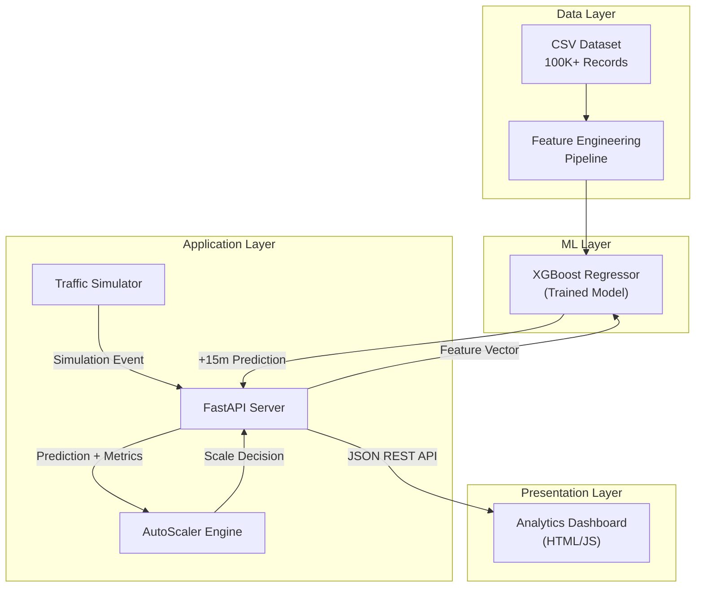
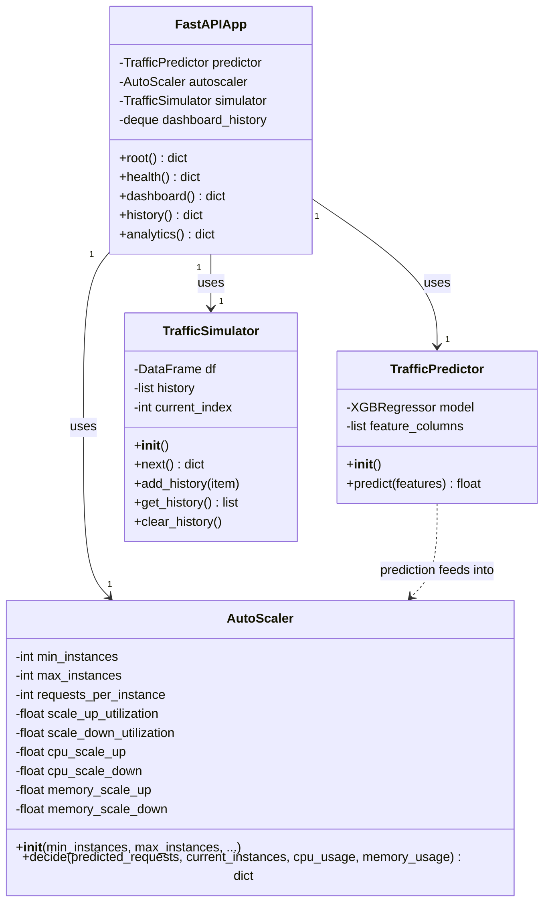
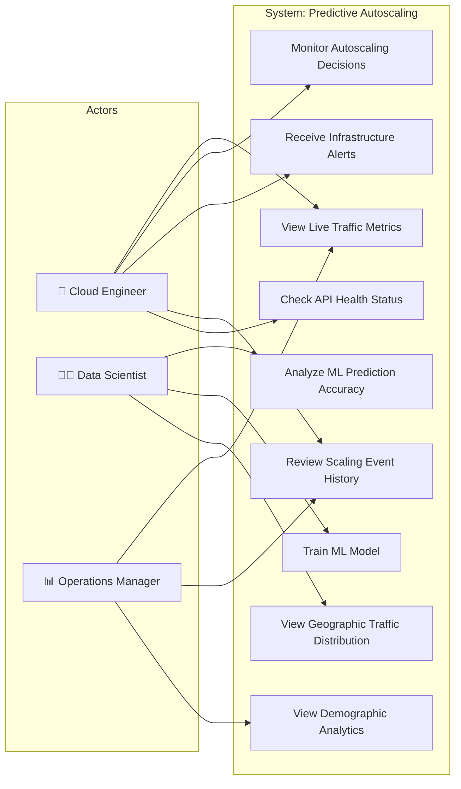
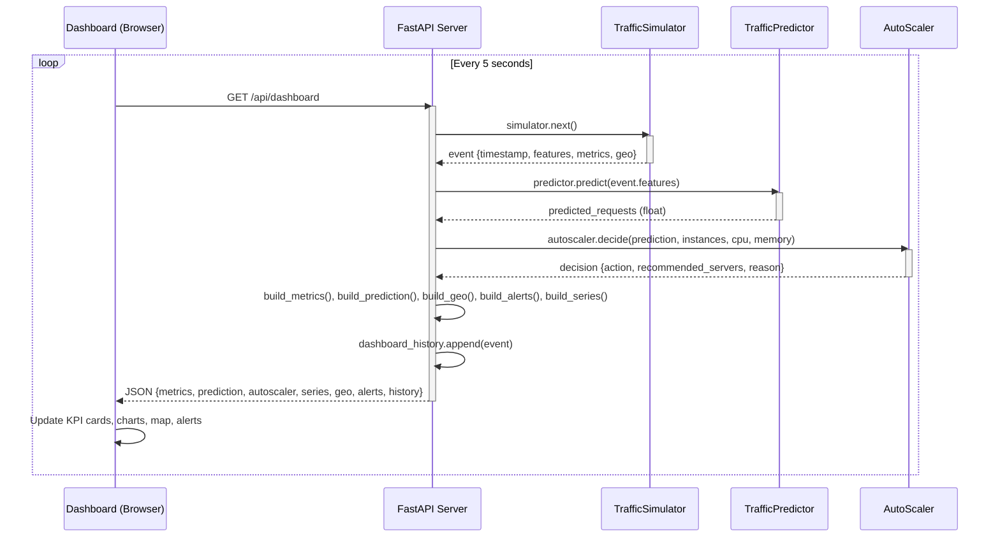
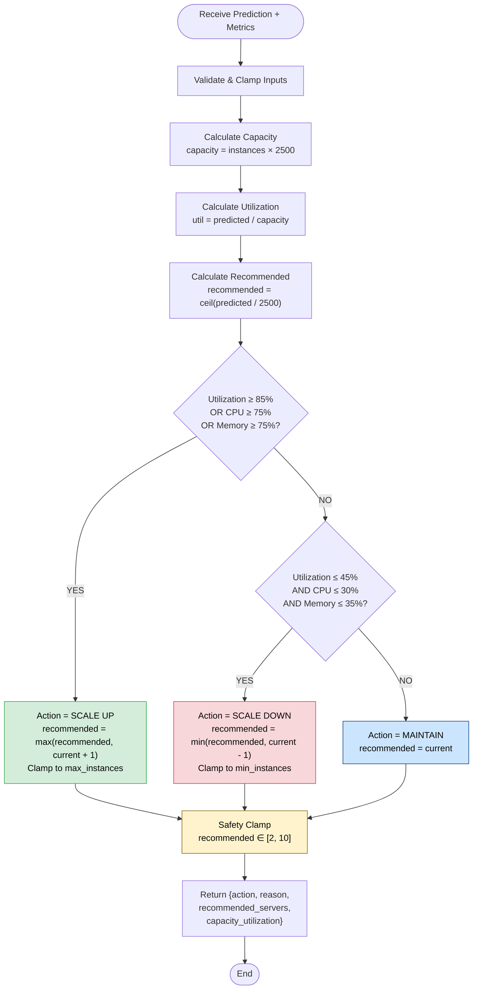
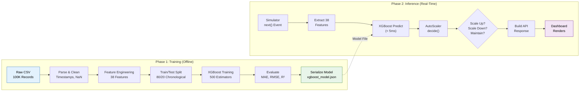
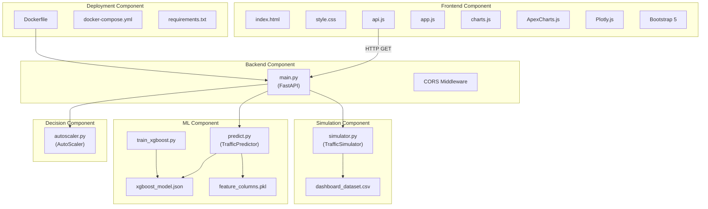
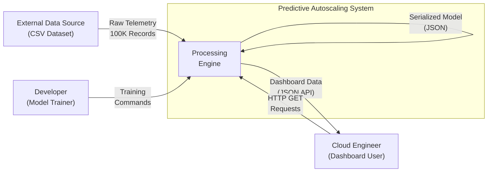

# Software Requirements Specification

## for

## Predictive Autoscaling Using Machine Learning on Cloud

### Version 2.0 approved

**Prepared by** Siddharth Negi, Kartikeya Singh, Chitranshi Maheshwari, Apoorv Aditya Jha, Abhinav Pandey

**IBM SkillsBuild Internship Program**

**July 2026**

---

## Table of Contents

- [Revision History](#revision-history)
- [1. Introduction](#1-introduction)
  - [1.1 Purpose](#11-purpose)
  - [1.2 Document Conventions](#12-document-conventions)
  - [1.3 Intended Audience and Reading Suggestions](#13-intended-audience-and-reading-suggestions)
  - [1.4 Project Scope](#14-project-scope)
  - [1.5 References](#15-references)
- [2. Overall Description](#2-overall-description)
  - [2.1 Product Perspective](#21-product-perspective)
  - [2.2 Product Features](#22-product-features)
  - [2.3 User Classes and Characteristics](#23-user-classes-and-characteristics)
  - [2.4 Operating Environment](#24-operating-environment)
  - [2.5 Design and Implementation Constraints](#25-design-and-implementation-constraints)
  - [2.6 User Documentation](#26-user-documentation)
  - [2.7 Assumptions and Dependencies](#27-assumptions-and-dependencies)
- [3. System Features](#3-system-features)
  - [3.1 Data Ingestion and Preprocessing Pipeline](#31-data-ingestion-and-preprocessing-pipeline)
  - [3.2 Feature Engineering Engine](#32-feature-engineering-engine)
  - [3.3 XGBoost Model Training and Inference](#33-xgboost-model-training-and-inference)
  - [3.4 Autoscaling Decision Engine](#34-autoscaling-decision-engine)
  - [3.5 Real-Time Traffic Simulation Engine](#35-real-time-traffic-simulation-engine)
  - [3.6 RESTful Backend API](#36-restful-backend-api)
  - [3.7 Real-Time Analytics Dashboard](#37-real-time-analytics-dashboard)
  - [3.8 Global Geographic Analytics](#38-global-geographic-analytics)
  - [3.9 Alert and Notification System](#39-alert-and-notification-system)
- [4. External Interface Requirements](#4-external-interface-requirements)
  - [4.1 User Interfaces](#41-user-interfaces)
  - [4.2 Hardware Interfaces](#42-hardware-interfaces)
  - [4.3 Software Interfaces](#43-software-interfaces)
  - [4.4 Communications Interfaces](#44-communications-interfaces)
- [5. Other Nonfunctional Requirements](#5-other-nonfunctional-requirements)
  - [5.1 Performance Requirements](#51-performance-requirements)
  - [5.2 Safety Requirements](#52-safety-requirements)
  - [5.3 Security Requirements](#53-security-requirements)
  - [5.4 Software Quality Attributes](#54-software-quality-attributes)
- [6. Other Requirements](#6-other-requirements)
- [Appendix A: Glossary](#appendix-a-glossary)
- [Appendix B: Analysis Models (UML & Control Flow Diagrams)](#appendix-b-analysis-models)
- [Appendix C: Issues List](#appendix-c-issues-list)

---

## Revision History

| Name | Date | Reason for Changes | Version |
| :--- | :--- | :--- | :--- |
| Siddharth Negi | May 2026 | Initial SRS draft with core functional requirements | 1.0 |
| Kartikeya Singh | June 2026 | Added ML pipeline, feature engineering, and API specs | 1.5 |
| Team | July 2026 | Final release — verified against implemented codebase, added UML/CFD | 2.0 |

---

## 1. Introduction

### 1.1 Purpose

This document specifies the complete software requirements for **Predictive Autoscaling Using Machine Learning on Cloud, Version 2.0**. It covers the entire system scope including the machine learning prediction engine, the deterministic autoscaling decision engine, the FastAPI REST backend, and the real-time HTML5 analytics dashboard.

The system replaces traditional reactive cloud autoscaling (which triggers only after resource thresholds are breached) with a **proactive, ML-driven approach** that forecasts cloud traffic 15 minutes ahead and pre-scales infrastructure before the load arrives. This eliminates SLA breaches, minimizes cold-start latency, and reduces cloud infrastructure waste.

### 1.2 Document Conventions

- **SHALL** indicates a mandatory requirement.
- **SHOULD** indicates a recommended but optional requirement.
- **MAY** indicates a purely optional requirement.
- Requirements are uniquely identified using the format `REQ-XXX` where XXX is a sequential number.
- Priority levels are defined as: **High** (must be implemented), **Medium** (important but not blocking), **Low** (nice-to-have).
- All priorities assigned to higher-level requirements are inherited by their child detailed requirements unless explicitly overridden.
- Code references use `monospace` formatting and point to actual project source files.
- All metric values referenced in this document (e.g., 98.5% accuracy, MAE=17.8) are verified outputs from the trained model, not targets.

### 1.3 Intended Audience and Reading Suggestions

This document is intended for the following audiences:

| Audience | Recommended Reading Path |
| :--- | :--- |
| **IBM Technical Reviewers** | Start with §1.4 (Scope), then §2.1–2.2 (Perspective & Features), then §3 (System Features) for detailed requirements, and finally Appendix B for UML diagrams. |
| **Academic Faculty / Viva Panel** | Start with §1.4, read §2 (Overall Description) in full, then focus on §3.3 (ML Model), §3.4 (Autoscaler), and §5 (Non-Functional Requirements). |
| **Development Engineers** | Read the entire document sequentially. Focus on §3 (functional requirements with REQ-IDs), §4 (interfaces), and Appendix B (class/sequence diagrams). |
| **Quality Assurance / Testers** | Focus on §3 (Stimulus/Response sequences for test case derivation), §5 (performance/quality targets), and Appendix C (known issues). |
| **Project Managers** | Read §1.4 (Scope), §2.2 (Feature Summary), §2.7 (Assumptions), and §6 (Other Requirements). |

### 1.4 Project Scope

**Predictive Autoscaling Using ML on Cloud** is a standalone, end-to-end intelligent infrastructure management system. It demonstrates that machine learning can fundamentally improve cloud resource allocation by shifting from a reactive penalty model to a proactive capacity model.

**Business Problem:** The global cloud computing industry loses an estimated $285 billion annually to resource waste caused by over-provisioning, while simultaneously suffering SLA breaches from under-provisioning during traffic spikes. Traditional rule-based autoscalers (e.g., "scale when CPU > 80%") have inherent boot-up delays of 3–10 minutes, during which user experience is degraded.

**Solution:** This system trains an XGBoost gradient-boosted regression model on 100,000+ historical cloud telemetry records to predict request volume 15 minutes into the future. A deterministic decision engine evaluates the prediction against current infrastructure capacity and issues Scale Up, Scale Down, or Maintain commands. The entire pipeline is visualized on a modern, real-time analytics dashboard.

**Key Deliverables:**
1. A trained, serialized XGBoost model (`xgboost_model.json`) achieving R² ≥ 0.97.
2. A rule-based autoscaling engine with configurable multi-metric thresholds.
3. A FastAPI REST backend serving 5 API endpoints.
4. A decoupled HTML5/JavaScript dashboard with 9 interactive panels.
5. Docker containerization for reproducible deployment.

**Out of Scope:** Direct integration with live cloud provider APIs (AWS CloudWatch, IBM Instana), real-time CDN log ingestion, online/incremental model retraining, and multi-model ensemble predictions. These are documented as future enhancements.

### 1.5 References

| # | Title | Author/Source | Version/Date |
| :--- | :--- | :--- | :--- |
| 1 | IEEE 830-1998 — Recommended Practice for Software Requirements Specifications | IEEE Standards Association | 1998 |
| 2 | XGBoost: A Scalable Tree Boosting System | Tianqi Chen & Carlos Guestrin, KDD 2016 | 2016 |
| 3 | Gartner Cloud Infrastructure Report | Gartner Inc. | 2024 |
| 4 | FastAPI Official Documentation | Sebastián Ramírez | https://fastapi.tiangolo.com |
| 5 | AWS Auto Scaling Developer Guide | Amazon Web Services | https://docs.aws.amazon.com/autoscaling |
| 6 | Scikit-Learn Metrics Documentation | scikit-learn.org | v1.3+ |
| 7 | ApexCharts.js Documentation | apexcharts.com | v3.x |
| 8 | Plotly.js Open Source Graphing Library | plotly.com | v2.x |
| 9 | Karl E. Wiegers SRS Template | Process Impact | 2002 |

---

## 2. Overall Description

### 2.1 Product Perspective

This product is a **new, self-contained system** developed as the final capstone project for the IBM SkillsBuild Internship Program. It is not a replacement for, or extension of, any existing commercial product. However, it is architecturally designed such that its core ML inference and autoscaling logic can be extracted and integrated into production cloud environments (AWS, IBM Cloud, GCP) with minimal refactoring.

The system is composed of four major subsystems that interact through well-defined interfaces:

### 2.2 Product Features

The following is a high-level summary of the major product features. Detailed functional requirements for each feature are provided in Section 3.

1. **Data Ingestion & Preprocessing** — Ingests 100,000+ rows of CSV cloud telemetry, handles missing values, encodes categoricals, and creates a shifted target for 15-minute-ahead forecasting.

2. **Feature Engineering** — Extracts 38 predictive features across four categories: temporal (7), lag (5), rolling statistics (6), and derived composite metrics (6), plus encoded and passthrough features.

3. **XGBoost Model Training** — Trains a gradient-boosted regressor with 500 estimators and an 80/20 chronological train/test split, achieving 98.5% accuracy and R² = 0.97.

4. **Autoscaling Decision Engine** — A deterministic, multi-metric rule engine that evaluates capacity utilization, CPU, and memory against configurable thresholds to issue Scale Up (ANY exceeded), Scale Down (ALL low), or Maintain commands.

5. **Traffic Simulation** — Iterates chronologically through the test dataset to simulate real-time traffic events, providing the same feature vectors to the model that would be available in a live environment.

6. **REST API Backend** — A high-performance FastAPI server exposing 5 endpoints (`/`, `/api/health`, `/api/dashboard`, `/api/history`, `/api/analytics`) that serve the complete system state as JSON.

7. **Real-Time Dashboard** — A decoupled HTML5/JavaScript frontend with 9 interactive panels including live traffic charts, autoscaling timelines, infrastructure gauges, and a world traffic map.

8. **Global Analytics** — Plotly-powered interactive choropleth map with country-level click handlers, demographic breakdowns (device, platform, subscription, content type), and regional aggregates.

9. **Alert System** — Real-time severity-coded alert feed triggered by CPU, memory, queue, and error rate thresholds.

### 2.3 User Classes and Characteristics

| User Class | Frequency | Functions Used | Technical Expertise | Priority |
| :--- | :--- | :--- | :--- | :--- |
| **Cloud Infrastructure Engineer** | Continuous (monitoring shifts) | Dashboard KPIs, autoscaling timeline, alert feed, infrastructure health | High — understands cloud architecture and scaling semantics | Favored |
| **ML/Data Engineer** | Periodic (model evaluation) | ML prediction panel, feature importance, model accuracy metrics | High — understands ML metrics (MAE, RMSE, R²) | Favored |
| **Operations Manager** | Daily (review) | KPI summary, cost optimization insights, scaling event counts | Medium — business-level understanding of cloud costs | Important |
| **Academic Reviewer** | One-time (viva) | Complete system walkthrough, architecture review, API verification | High — evaluating engineering rigor and completeness | Important |
| **DevOps Engineer** | Periodic (deployment) | Docker configuration, API health check, log output | High — container orchestration and CI/CD experience | Secondary |

### 2.4 Operating Environment

| Component | Minimum Requirement |
| :--- | :--- |
| **Operating System** | Windows 10/11, Ubuntu 20.04 LTS+, macOS 12 Monterey+ |
| **Python Runtime** | Python 3.11 or higher |
| **Memory (RAM)** | 4 GB minimum (8 GB recommended for concurrent training + serving) |
| **CPU** | Dual-core x86_64 processor (quad-core recommended) |
| **Disk Space** | 5 GB (including dataset, models, and virtual environment) |
| **Docker** | Docker Engine 24.0+ and Docker Compose 2.20+ (for containerized deployment) |
| **Web Browser** | Google Chrome 110+, Mozilla Firefox 110+, Microsoft Edge 110+ |
| **Network** | Localhost access (no internet required for execution) |

### 2.5 Design and Implementation Constraints

| ID | Constraint | Rationale |
| :--- | :--- | :--- |
| DC-1 | The ML model MUST be serializable to XGBoost's native JSON format (`xgboost_model.json`). | Ensures portability across platforms without Python pickle dependencies. |
| DC-2 | The frontend MUST be fully decoupled from the backend — no server-side rendering (SSR). | Allows independent deployment and scaling of UI and API layers. |
| DC-3 | The API MUST implement CORS middleware to allow cross-origin requests. | Required because the frontend runs on a different origin (file:// or separate HTTP port). |
| DC-4 | All autoscaler decisions MUST be deterministic — the same inputs must always produce the same output. | Critical for audit trails, debugging, and regulatory compliance in production. |
| DC-5 | The system MUST operate without any external cloud API keys or secrets. | The system is a simulation; no real cloud resources are provisioned. |
| DC-6 | The frontend MUST function without a Node.js build step. | Uses vanilla HTML/JS/CSS for simplicity and zero-dependency deployment. |
| DC-7 | Python dependencies MUST be pinnable via `requirements.txt`. | Ensures reproducible environments across development, testing, and Docker. |
| DC-8 | The dataset MUST remain in CSV format for transparency and academic review. | Allows reviewers to inspect raw data without specialized database tooling. |

### 2.6 User Documentation

The following documentation components are delivered with the software:

| Document | Format | Location |
| :--- | :--- | :--- |
| Project README | Markdown | `README.md` (repository root) |
| Software Requirements Specification (this document) | Markdown | `docs/SRS.md` |
| Architecture Guide | Markdown | `docs/Architecture.md` |
| Dataset Description | Markdown | `docs/Dataset.md` |
| Model Documentation | Markdown | `docs/Model.md` |
| Deployment Guide | Markdown | `docs/Deployment.md` |
| User Guide | Markdown | `docs/User_Guide.md` |
| Interactive Training Notebook | Jupyter Notebook | `notebooks/XGBoost_Training.ipynb` |
| API Self-Documentation | Auto-generated (Swagger) | `http://localhost:8000/docs` (when running) |

### 2.7 Assumptions and Dependencies

**Assumptions:**

| # | Assumption |
| :--- | :--- |
| A1 | Cloud VM boot time is less than 15 minutes, falling within the forecast horizon. If VMs take longer to boot, the forecast window must be extended by adjusting `FORECAST_STEPS`. |
| A2 | Cloud traffic exhibits daily and weekly seasonality (peak hours, weekdays vs. weekends) that is learnable from historical data. |
| A3 | The relationship between infrastructure metrics (CPU, memory, network I/O) and future request volume is non-linear but can be captured by gradient-boosted trees. |
| A4 | Each server instance can handle approximately 2,500 requests per 5-minute interval. This value is configurable via the `requests_per_instance` parameter. |
| A5 | The simulation dataset is representative of real-world cloud traffic patterns. |
| A6 | The user has Python 3.11+ installed, or Docker available for containerized execution. |

**Dependencies:**

| # | Dependency | Impact if Unavailable |
| :--- | :--- | :--- |
| D1 | `xgboost` Python package (v2.0+) | Model training and inference will fail. |
| D2 | `fastapi` + `uvicorn` packages | Backend API cannot start. |
| D3 | `pandas` + `numpy` packages | Data processing and feature engineering will fail. |
| D4 | `scikit-learn` package | Model evaluation metrics cannot be computed. |
| D5 | `joblib` package | Feature column list cannot be deserialized. |
| D6 | ApexCharts.js (vendored in `frontend/vendor/`) | Dashboard charts will not render. |
| D7 | Plotly.js (vendored in `frontend/vendor/`) | World map and geographic visualizations will not render. |
| D8 | Bootstrap 5 (vendored in `frontend/vendor/`) | Dashboard layout and responsiveness will break. |

---

## 3. System Features

### 3.1 Data Ingestion and Preprocessing Pipeline

#### 3.1.1 Description and Priority

**Priority: High**

The data pipeline is the foundation of the entire system. It ingests raw cloud infrastructure telemetry from a CSV file, performs cleaning and transformation, and produces a processed dataset ready for feature engineering and model training. Without a clean, well-structured dataset, all downstream components (ML model, simulator, dashboard) will fail.

**Source Files:** `src/train_xgboost.py` (lines 14–31), `app/simulator.py` (lines 9–19)

#### 3.1.2 Stimulus/Response Sequences

| Step | Actor | Action | System Response |
| :--- | :--- | :--- | :--- |
| 1 | Developer | Runs `python src/train_xgboost.py` | System reads `data/processed/processed_cloud_traffic.csv` into a Pandas DataFrame |
| 2 | System | Validates dataset | Confirms 100,001 rows loaded, prints column count |
| 3 | System | Creates target variable | Shifts `request_count` backward by 3 steps (15 min ahead) |
| 4 | System | Drops incomplete rows | Removes rows with NaN values from lag/rolling operations |
| 5 | System | Prints summary | Displays "Forecast Horizon: 15 Minutes", feature count, sample count |

#### 3.1.3 Functional Requirements

| ID | Requirement | Priority |
| :--- | :--- | :--- |
| REQ-001 | The system SHALL load the raw dataset from `data/raw/cloud_traffic_dataset.csv` containing ≥ 100,000 records. | High |
| REQ-002 | The system SHALL parse the `timestamp` column to `datetime` format and sort chronologically. | High |
| REQ-003 | The system SHALL encode categorical columns (`region`, `zone`, `app_type`) to integer labels using label encoding. | Medium |
| REQ-004 | The system SHALL impute missing values using forward-fill and clamp anomalous readings to valid ranges (0–100% for percentages). | High |
| REQ-005 | The system SHALL create a future target variable `target` by shifting `request_count` backward by `FORECAST_STEPS = 3` (equivalent to 15 minutes at 5-minute intervals). | High |
| REQ-006 | The system SHALL drop all rows containing NaN values after target creation and feature engineering. | High |
| REQ-007 | The system SHALL produce a processed dataset with ≥ 99,000 clean records after all transformations. | High |

---

### 3.2 Feature Engineering Engine

#### 3.2.1 Description and Priority

**Priority: High**

The feature engineering engine transforms raw infrastructure metrics into 38 predictive features across four categories: temporal, lag, rolling statistics, and derived composites. These features capture short-term trends, seasonality, momentum, and resource pressure — all critical for accurate traffic forecasting. Feature engineering is the single most impactful step for model accuracy.

**Source Files:** `notebooks/XGBoost_Training.ipynb`, `src/train_xgboost.py` (lines 39–49)

#### 3.2.2 Stimulus/Response Sequences

| Step | Actor | Action | System Response |
| :--- | :--- | :--- | :--- |
| 1 | System | Receives cleaned DataFrame | Begins feature extraction pipeline |
| 2 | System | Extracts temporal features | Adds 7 columns: `hour`, `day`, `month`, `day_of_week`, `week`, `quarter`, `is_weekend` |
| 3 | System | Creates lag features | Adds 5 columns: `request_lag_1`, `request_lag_3`, `request_lag_6`, `request_lag_12`, `request_lag_24` |
| 4 | System | Computes rolling statistics | Adds 6 columns: `rolling_mean_6`, `rolling_std_6`, `rolling_mean_12`, `rolling_std_12`, `rolling_max_12`, `rolling_min_12` |
| 5 | System | Derives composite metrics | Adds 6 columns: `traffic_growth_rate`, `request_velocity`, `traffic_momentum`, `cpu_memory_ratio`, `network_total`, `resource_pressure` |
| 6 | System | Drops non-feature columns | Removes `timestamp`, `request_count`, and `target` from the feature matrix `X` |
| 7 | System | Outputs feature matrix | Returns DataFrame `X` with exactly 38 columns |

#### 3.2.3 Functional Requirements

| ID | Requirement | Priority |
| :--- | :--- | :--- |
| REQ-010 | The system SHALL extract 7 temporal features: `hour` (0–23), `day` (1–31), `month` (1–12), `day_of_week` (0=Monday to 6=Sunday), `week` (1–52), `quarter` (1–4), and `is_weekend` (binary 0/1). | High |
| REQ-011 | The system SHALL create 5 lag features by shifting `request_count` by 1, 3, 6, 12, and 24 time steps respectively. | High |
| REQ-012 | The system SHALL compute rolling mean and standard deviation over windows of 6 and 12 time steps, plus rolling max and min over a 12-step window (6 features total). | High |
| REQ-013 | The system SHALL derive 6 composite metrics: `traffic_growth_rate` (percentage change), `request_velocity` (rate of change), `traffic_momentum` (rolling acceleration), `cpu_memory_ratio` (CPU÷Memory), `network_total` (network_in + network_out), and `resource_pressure` (weighted combination of CPU, memory, and queue length). | Medium |
| REQ-014 | The total engineered feature count SHALL be exactly 38. | High |
| REQ-015 | The system SHALL persist the ordered list of feature column names to `models/feature_columns.pkl` for inference-time alignment. | High |

---

### 3.3 XGBoost Model Training and Inference

#### 3.3.1 Description and Priority

**Priority: High**

This is the core ML component. An XGBoost Gradient Boosted Regressor is trained on the engineered features to predict `request_count` 15 minutes into the future. The trained model is serialized to disk and loaded at runtime by the inference engine (`TrafficPredictor` class) to serve real-time predictions with sub-5ms latency.

**Source Files:** `src/train_xgboost.py` (training), `src/predict.py` (inference)

#### 3.3.2 Stimulus/Response Sequences

**Training:**

| Step | Actor | Action | System Response |
| :--- | :--- | :--- | :--- |
| 1 | Developer | Runs `python src/train_xgboost.py` | Loads processed dataset, creates 80/20 chronological split |
| 2 | System | Initializes XGBoost | Creates `XGBRegressor` with specified hyperparameters |
| 3 | System | Trains model | Fits on training data (~80,000 samples), prints "Training Completed" |
| 4 | System | Evaluates model | Computes MAE, RMSE, R² on test set (~20,000 samples) |
| 5 | System | Serializes model | Saves to `models/xgboost_model.json` and `models/xgboost_model.pkl` |
| 6 | System | Saves predictions | Writes actual vs. predicted values to `models/future_predictions.csv` |

**Inference:**

| Step | Actor | Action | System Response |
| :--- | :--- | :--- | :--- |
| 1 | API Server | Instantiates `TrafficPredictor()` | Loads `xgboost_model.json` and `feature_columns.pkl` into memory |
| 2 | Dashboard Call | `/api/dashboard` is requested | Simulator provides current event with 38-feature vector |
| 3 | System | Calls `predictor.predict(features)` | Reorders features to match training order, runs `model.predict()` |
| 4 | System | Returns prediction | Returns `float` — the predicted request count 15 minutes ahead |

#### 3.3.3 Functional Requirements

| ID | Requirement | Priority |
| :--- | :--- | :--- |
| REQ-020 | The system SHALL train an `XGBRegressor` with `objective="reg:squarederror"`. | High |
| REQ-021 | The model SHALL use the following hyperparameters: `n_estimators=500`, `learning_rate=0.05`, `max_depth=8`, `min_child_weight=3`, `subsample=0.8`, `colsample_bytree=0.8`, `gamma=0.1`, `random_state=42`, `n_jobs=-1`. | High |
| REQ-022 | The system SHALL perform an 80/20 chronological train/test split without shuffling to preserve time-series integrity. | High |
| REQ-023 | The trained model SHALL achieve: MAE ≤ 20, RMSE ≤ 30, and R² ≥ 0.95 on the test set. | High |
| REQ-024 | The system SHALL serialize the trained model to `models/xgboost_model.json` (XGBoost native format). | High |
| REQ-025 | The `TrafficPredictor.predict()` method SHALL accept a `pd.DataFrame`, `pd.Series`, or `dict` as input and return a single `float`. | High |
| REQ-026 | The `TrafficPredictor` SHALL reorder input features to match the exact column order used during training. | High |
| REQ-027 | Model inference latency SHALL be less than 5 milliseconds per prediction. | High |

---

### 3.4 Autoscaling Decision Engine

#### 3.4.1 Description and Priority

**Priority: High**

The autoscaling decision engine is a deterministic, rule-based system that evaluates the XGBoost prediction alongside current infrastructure metrics (CPU, memory) to produce a scaling action. It serves as the "actuator" of the intelligent loop — translating ML predictions into concrete infrastructure actions.

**Source File:** `src/autoscaler.py`

#### 3.4.2 Stimulus/Response Sequences

| Step | Actor | Action | System Response |
| :--- | :--- | :--- | :--- |
| 1 | API Server | Calls `autoscaler.decide(predicted_requests, current_instances, cpu_usage, memory_usage)` | Engine validates and clamps all inputs |
| 2 | System | Calculates capacity | `current_capacity = current_instances × requests_per_instance (2500)` |
| 3 | System | Calculates utilization | `utilization = predicted_requests / current_capacity` |
| 4 | System | Evaluates SCALE UP rules | If utilization ≥ 85% OR CPU ≥ 75% OR Memory ≥ 75% → SCALE UP |
| 5 | System | Evaluates SCALE DOWN rules | If utilization ≤ 45% AND CPU ≤ 30% AND Memory ≤ 35% → SCALE DOWN |
| 6 | System | Default action | If neither condition met → MAINTAIN |
| 7 | System | Clamps result | `recommended_instances` clamped to [min_instances=2, max_instances=10] |
| 8 | System | Returns decision | Returns dict with `action`, `reason`, `recommended_servers`, `capacity_utilization` |

#### 3.4.3 Functional Requirements

| ID | Requirement | Priority |
| :--- | :--- | :--- |
| REQ-030 | The engine SHALL accept four inputs: `predicted_requests` (float), `current_instances` (int), `cpu_usage` (float, 0–100), `memory_usage` (float, 0–100). | High |
| REQ-031 | The engine SHALL validate and clamp inputs: `predicted_requests ≥ 0`, `cpu_usage` and `memory_usage` in [0, 100], `current_instances` in [min_instances, max_instances]. | High |
| REQ-032 | The engine SHALL issue **SCALE UP** when ANY of the following conditions is true: capacity utilization ≥ 85%, CPU usage ≥ 75%, or memory usage ≥ 75%. | High |
| REQ-033 | The engine SHALL issue **SCALE DOWN** when ALL of the following conditions are true: capacity utilization ≤ 45%, CPU usage ≤ 30%, and memory usage ≤ 35%. | High |
| REQ-034 | The engine SHALL issue **MAINTAIN** when neither SCALE UP nor SCALE DOWN conditions are met. | High |
| REQ-035 | On SCALE UP, `recommended_instances` SHALL be at least `current_instances + 1`. | High |
| REQ-036 | On SCALE DOWN, `recommended_instances` SHALL be at most `current_instances - 1`. | High |
| REQ-037 | `recommended_instances` SHALL always be clamped to the range [min_instances=2, max_instances=10]. | High |
| REQ-038 | The engine SHALL return a human-readable `reason` string explaining the decision rationale. | Medium |
| REQ-039 | The decision function SHALL be purely deterministic — identical inputs must always produce identical outputs. | High |

---

### 3.5 Real-Time Traffic Simulation Engine

#### 3.5.1 Description and Priority

**Priority: High**

The traffic simulator replaces live cloud telemetry with a deterministic replay of historical test data. It iterates chronologically through the processed dataset, providing the same feature vectors, infrastructure metrics, and geographic metadata that would be available in a production environment. This allows the ML model and autoscaler to be tested end-to-end without requiring real cloud infrastructure.

**Source File:** `app/simulator.py`

#### 3.5.2 Stimulus/Response Sequences

| Step | Actor | Action | System Response |
| :--- | :--- | :--- | :--- |
| 1 | API Server | Calls `simulator.next()` | Returns the next chronological event from the dataset |
| 2 | System | Extracts features | Drops non-numeric and metadata columns, coerces to numeric |
| 3 | System | Reads infrastructure values | Extracts CPU, memory, network, response time, error rate, etc. |
| 4 | System | Reads geo metadata | Extracts country, region, device type, platform, subscription |
| 5 | System | Wraps into event dict | Returns complete event with `timestamp`, `features`, `current_requests`, `future_requests`, and all metrics |
| 6 | System | Advances index | Increments internal pointer; wraps to 0 at end of dataset |

#### 3.5.3 Functional Requirements

| ID | Requirement | Priority |
| :--- | :--- | :--- |
| REQ-040 | The simulator SHALL load `data/processed/dashboard_dataset.csv` on initialization and sort chronologically by `timestamp`. | High |
| REQ-041 | The `next()` method SHALL return a dictionary containing: `timestamp`, `current_requests`, `future_requests`, `features` (DataFrame), and all infrastructure metrics (cpu_usage, memory_usage, network_in, network_out, disk_io, response_time, error_rate, cache_hit_rate, queue_length, current_servers). | High |
| REQ-042 | The simulator SHALL wrap around to index 0 when the end of the dataset is reached, enabling continuous operation. | High |
| REQ-043 | The simulator SHALL maintain a history buffer of up to 100 events via `add_history()`. | Medium |
| REQ-044 | Server instance count SHALL be clamped to [2, 10] to match autoscaler constraints. | High |

---

### 3.6 RESTful Backend API

#### 3.6.1 Description and Priority

**Priority: High**

The FastAPI backend is the central coordination layer that connects the simulator, ML predictor, and autoscaler into a unified event loop. Each API call advances the simulation by one step, runs a prediction, evaluates autoscaling rules, and returns the complete system state as a structured JSON payload.

**Source File:** `main.py`

#### 3.6.2 Stimulus/Response Sequences

| Step | Actor | Action | System Response |
| :--- | :--- | :--- | :--- |
| 1 | Dashboard Frontend | `GET /api/dashboard` | Server calls `simulator.next()` to get current event |
| 2 | Server | Runs prediction | Calls `predictor.predict(event["features"])`, gets +15m forecast |
| 3 | Server | Evaluates autoscaler | Calls `autoscaler.decide()` with prediction + current metrics |
| 4 | Server | Builds response | Assembles metrics, prediction, autoscaler, series, geo, and alerts objects |
| 5 | Server | Stores history | Appends event to `dashboard_history` deque (maxlen=50) |
| 6 | Server | Returns JSON | Sends unified payload to the frontend |

#### 3.6.3 Functional Requirements

| ID | Requirement | Priority |
| :--- | :--- | :--- |
| REQ-050 | The API SHALL be implemented using FastAPI with Uvicorn ASGI server. | High |
| REQ-051 | `GET /` SHALL return `{ project, status, version }`. | Low |
| REQ-052 | `GET /api/health` SHALL return the load status of predictor, simulator, and autoscaler components. | Medium |
| REQ-053 | `GET /api/dashboard` SHALL advance the simulation by one step, run prediction, evaluate autoscaler, and return a unified JSON payload containing: `metrics`, `prediction`, `autoscaler`, `series`, `geo`, `alerts`, and `history`. | High |
| REQ-054 | `GET /api/history` SHALL return the last 50 dashboard events from the sliding window buffer. | Medium |
| REQ-055 | `GET /api/analytics` SHALL return aggregate statistics: `average_prediction`, `average_cpu`, `average_memory`, `scale_up_events`, `scale_down_events`, `maintain_events`. | Medium |
| REQ-056 | The API SHALL enable CORS middleware allowing all origins (`allow_origins=["*"]`). | Medium |
| REQ-057 | All API errors SHALL return structured JSON with HTTP status code 500 and a `detail` field containing the error message. | Medium |
| REQ-058 | The API SHALL log full stack traces to stdout on errors for debugging. | Low |

---

### 3.7 Real-Time Analytics Dashboard

#### 3.7.1 Description and Priority

**Priority: High**

The dashboard is the primary user-facing component. It provides a single-page, responsive interface that polls the backend API every 5 seconds and renders live visualizations of traffic, predictions, infrastructure health, and autoscaling decisions.

**Source Files:** `frontend/index.html`, `frontend/js/app.js`, `frontend/js/api.js`, `frontend/js/charts.js`, `frontend/css/style.css`

#### 3.7.2 Stimulus/Response Sequences

| Step | Actor | Action | System Response |
| :--- | :--- | :--- | :--- |
| 1 | User | Opens `frontend/index.html` in a browser | Dashboard initializes, sets up a 5-second polling interval |
| 2 | Dashboard | Sends `GET /api/dashboard` | Receives unified JSON payload |
| 3 | Dashboard | Updates KPI cards | Renders current values for traffic, CPU, memory, servers, etc. |
| 4 | Dashboard | Updates charts | Redraws Actual vs. Predicted line chart, autoscaling timeline, infrastructure gauges |
| 5 | Dashboard | Updates world map | Redraws Plotly choropleth with latest country-level traffic data |
| 6 | Dashboard | Updates alert feed | Appends new alerts with severity color-coding |
| 7 | System | Repeats every 5 seconds | Dashboard remains continuously updated |

#### 3.7.3 Functional Requirements

| ID | Requirement | Priority |
| :--- | :--- | :--- |
| REQ-060 | The dashboard SHALL display a KPI grid showing at minimum: Request Count, Active Users, CPU Usage, Memory Usage, Server Count, Response Time, Error Rate, and Cache Hit Rate. | High |
| REQ-061 | The dashboard SHALL render an Actual vs. Predicted traffic line chart with the last 20 data points using ApexCharts. | High |
| REQ-062 | The dashboard SHALL render an autoscaling decision timeline showing Scale Up (green), Scale Down (red), and Maintain (blue) events. | High |
| REQ-063 | The dashboard SHALL render ML model performance metrics including accuracy, MAE, RMSE, R², and model status. | Medium |
| REQ-064 | The dashboard SHALL render an infrastructure health score gauge using a radial bar chart. | Medium |
| REQ-065 | The dashboard SHALL display a real-time alert feed with severity levels: `critical` (red), `warning` (yellow), `info` (blue). | Medium |
| REQ-066 | The dashboard SHALL poll the backend API at a configurable interval (default: 5000 milliseconds). | High |
| REQ-067 | The dashboard SHALL be fully responsive and usable at viewport widths ≥ 1024px. | Medium |

---

### 3.8 Global Geographic Analytics

#### 3.8.1 Description and Priority

**Priority: Medium**

The geographic analytics module provides a visual representation of worldwide traffic distribution. It features an interactive Plotly.js choropleth world map where users can click on countries to view regional infrastructure metrics, alongside demographic breakdown charts.

**Source File:** `main.py` (function `build_geo()`), `frontend/js/charts.js`

#### 3.8.2 Stimulus/Response Sequences

| Step | Actor | Action | System Response |
| :--- | :--- | :--- | :--- |
| 1 | Dashboard | Receives `geo` object from API | Passes country data to Plotly |
| 2 | Dashboard | Renders choropleth | Displays color-coded world map based on request volume |
| 3 | User | Clicks on a country | Tooltip shows country name, CPU, memory, latency, and cloud region |
| 4 | Dashboard | Renders demographic charts | Displays donut/bar charts for device types, platforms, subscriptions, and content types |

#### 3.8.3 Functional Requirements

| ID | Requirement | Priority |
| :--- | :--- | :--- |
| REQ-070 | The system SHALL generate simulated traffic data for ≥ 10 countries with ISO3 codes. | Medium |
| REQ-071 | The dashboard SHALL render an interactive Plotly.js choropleth world map. | Medium |
| REQ-072 | Country click events SHALL display a tooltip with: country name, request count, CPU usage, memory usage, latency (ms), and cloud region identifier. | Medium |
| REQ-073 | The system SHALL provide breakdown charts for: Device Type (Desktop, Mobile, Smart TV, Tablet), Platform (Web, Android, iOS, TV), Subscription (Basic, Standard, Premium), and Content Type (Movies, Series, Sports, Kids). | Medium |

---

### 3.9 Alert and Notification System

#### 3.9.1 Description and Priority

**Priority: Medium**

The alert system evaluates real-time infrastructure metrics against safety thresholds and generates severity-coded notifications displayed on the dashboard. It provides early warning of potential system degradation.

**Source File:** `main.py` (function `build_alerts()`)

#### 3.9.2 Stimulus/Response Sequences

| Step | Actor | Action | System Response |
| :--- | :--- | :--- | :--- |
| 1 | System | Evaluates CPU | If CPU ≥ 80% → Critical alert; If CPU ≥ 70% → Warning alert |
| 2 | System | Evaluates Memory | If Memory ≥ 85% → Critical alert |
| 3 | System | Evaluates Queue | If Queue Length ≥ 15 → Warning alert |
| 4 | System | Evaluates Error Rate | If Error Rate ≥ 1% → Critical alert |
| 5 | System | Logs autoscaler action | Always appends an Info-level alert with the current scaling action |

#### 3.9.3 Functional Requirements

| ID | Requirement | Priority |
| :--- | :--- | :--- |
| REQ-080 | The system SHALL generate a `critical` alert when CPU usage ≥ 80%. | Medium |
| REQ-081 | The system SHALL generate a `warning` alert when CPU usage ≥ 70% and < 80%. | Medium |
| REQ-082 | The system SHALL generate a `critical` alert when Memory usage ≥ 85%. | Medium |
| REQ-083 | The system SHALL generate a `warning` alert when Queue Length ≥ 15. | Medium |
| REQ-084 | The system SHALL generate a `critical` alert when Error Rate ≥ 1%. | Medium |
| REQ-085 | The system SHALL always generate an `info` alert with the current autoscaler action. | Low |
| REQ-086 | Each alert SHALL contain: `severity` (critical/warning/info), `title`, and `message`. | Medium |

---

## 4. External Interface Requirements

### 4.1 User Interfaces

The primary user interface is a **single-page web dashboard** built with HTML5, CSS3, and JavaScript. It communicates with the backend exclusively through REST API calls.

**Dashboard Layout (from top to bottom):**

1. **Navigation Bar** — Project title, status indicator, and navigation links.
2. **KPI Card Grid** — 8 metric cards arranged in a responsive grid, each showing current value, unit, and trend direction.
3. **Live Traffic Chart** — Full-width dual-axis line chart (ApexCharts) showing Actual vs. Predicted request counts with a 20-point sliding window.
4. **Two-Column Layout:**
   - Left: ML Prediction panel (accuracy gauge, MAE, RMSE, R², model status)
   - Right: Autoscaling Timeline (color-coded event bar chart)
5. **Infrastructure Health Panel** — Radial gauge showing overall system health score.
6. **World Traffic Map** — Full-width interactive Plotly choropleth with click handlers.
7. **Demographic Charts** — Four donut/bar charts showing device, platform, subscription, and content distribution.
8. **Alert Feed** — Scrollable log of severity-coded alerts.

**Design Conventions:**
- Dark theme (navy/charcoal background, white/cyan text) for professional operations-center aesthetics.
- Color coding: Green = healthy/scale-down, Red = critical/scale-up, Blue = info/maintain, Yellow = warning.
- All charts use smooth animations for data transitions.
- Font: Inter (Google Fonts) for modern, readable typography.

### 4.2 Hardware Interfaces

The system has **no direct hardware interfaces**. It operates entirely in software, reading historical telemetry data from CSV files stored on the local filesystem.

In a future production deployment, hardware interfaces would include:
- AWS CloudWatch API for ingesting live EC2/ECS metrics.
- IBM Instana agent for real-time container telemetry.
- Network load balancer health check endpoints.

### 4.3 Software Interfaces

| Interface | Components | Protocol | Data Format | Purpose |
| :--- | :--- | :--- | :--- | :--- |
| Frontend → Backend | `frontend/js/api.js` → `main.py` | HTTP/1.1 REST | JSON | Dashboard polls API every 5 seconds for updated state |
| Backend → ML Model | `main.py` → `src/predict.py` | In-process Python method call | Pandas DataFrame → float | FastAPI calls `predictor.predict()` for each simulation step |
| Backend → Autoscaler | `main.py` → `src/autoscaler.py` | In-process Python method call | kwargs → dict | FastAPI calls `autoscaler.decide()` with prediction + metrics |
| Backend → Simulator | `main.py` → `app/simulator.py` | In-process Python method call | None → dict | FastAPI calls `simulator.next()` to advance simulation |
| Backend → Dataset | `app/simulator.py` → `data/processed/` | Pandas CSV reader | CSV → DataFrame | Simulator loads dataset on initialization |
| Training → Model File | `src/train_xgboost.py` → `models/` | File I/O | JSON + Pickle | Training script serializes model and feature columns |
| Docker → Host | `docker-compose.yml` | TCP port mapping | N/A | Exposes services on ports 8000 (API) and 8501 (Streamlit) |

### 4.4 Communications Interfaces

| Protocol | Port | Direction | Service | Details |
| :--- | :--- | :--- | :--- | :--- |
| HTTP/1.1 | 8000 | Inbound | FastAPI Backend | REST API accepting GET requests, returning JSON responses |
| HTTP/1.1 | 8501 | Inbound | Streamlit Dashboard (Docker) | Alternative Streamlit-based dashboard |
| file:// | N/A | Local | Frontend Dashboard | `index.html` opened directly in browser for development |
| TCP | 8000 | Internal (Docker) | Container networking | Inter-container communication within Docker Compose network |

**Data Transfer:** All API responses use JSON encoding with UTF-8 character set. No binary protocols, WebSockets, or streaming connections are used in the current version. The polling architecture (HTTP GET every 5 seconds) was chosen for simplicity and browser compatibility over WebSocket for this simulation use case.

---

## 5. Other Nonfunctional Requirements

### 5.1 Performance Requirements

| ID | Requirement | Target | Rationale |
| :--- | :--- | :--- | :--- |
| PERF-001 | ML model inference latency | < 5 ms per prediction | Ensures real-time API response without bottlenecking on model inference. XGBoost tree traversal on 38 features is inherently fast. |
| PERF-002 | API response time (p95) | < 200 ms | Dashboard polls every 5 seconds; responses must complete well within this window to prevent request pileup. |
| PERF-003 | Dashboard refresh cycle | 5 seconds (configurable) | Provides near-real-time updates without excessive API load. Configurable via JavaScript constant. |
| PERF-004 | Concurrent API connections | ≥ 50 simultaneous | Uvicorn's async architecture supports high concurrency; 50 clients represents a reasonable demonstration ceiling. |
| PERF-005 | Dataset load time | < 3 seconds for 100K rows | Pandas CSV reader with optimized dtypes; blocks API startup until complete. |
| PERF-006 | Memory footprint (running) | < 500 MB | Dataset (~55 MB) + model + FastAPI overhead should remain well under 500 MB. |
| PERF-007 | Dashboard chart render time | < 100 ms per update | ApexCharts incremental updates (not full redraws) ensure smooth animations. |

### 5.2 Safety Requirements

| ID | Requirement | Details |
| :--- | :--- | :--- |
| SAFE-001 | The autoscaler SHALL never recommend fewer than `min_instances` (2) servers. | Prevents complete infrastructure shutdown. A minimum of 2 ensures basic availability even during absolute traffic lulls. |
| SAFE-002 | The autoscaler SHALL never recommend more than `max_instances` (10) servers. | Prevents runaway scaling that could cause cost explosions in a real cloud environment. |
| SAFE-003 | All numeric inputs to the autoscaler SHALL be validated and clamped before processing. | `cpu_usage` and `memory_usage` are clamped to [0, 100]; `predicted_requests` is clamped to ≥ 0; `current_instances` is clamped to [min, max]. |
| SAFE-004 | API errors SHALL NOT crash the server. | All endpoint handlers use try/except with traceback logging and HTTP 500 JSON responses. |
| SAFE-005 | The simulator SHALL wrap to index 0 upon reaching the end of the dataset. | Prevents index-out-of-bounds crashes during long-running demonstrations. |

### 5.3 Security Requirements

| ID | Requirement | Details |
| :--- | :--- | :--- |
| SEC-001 | The system SHALL NOT store any credentials, API keys, tokens, or secrets. | The system is a simulation; no real cloud resources are accessed. |
| SEC-002 | CORS policy SHALL be configurable. | Currently set to `allow_origins=["*"]` for development; production deployments should restrict to specific frontend domains. |
| SEC-003 | No user authentication is required in the current version. | The system is designed for local/demo use. Authentication middleware (OAuth2, JWT) should be added for production. |
| SEC-004 | Input validation SHALL be performed on all API inputs. | Currently all endpoints are GET with no user-supplied parameters, minimizing injection risk. |

### 5.4 Software Quality Attributes

| Attribute | Target | How Achieved |
| :--- | :--- | :--- |
| **Maintainability** | High | Modular architecture with clear separation: `predict.py`, `autoscaler.py`, `simulator.py`, and `main.py` are independent, testable units. |
| **Portability** | High | Runs on Windows, Linux, macOS. Docker containerization eliminates environment-specific dependencies. |
| **Testability** | High | Each core module (`AutoScaler`, `TrafficPredictor`, `TrafficSimulator`) has a dedicated test file. Autoscaler logic is purely functional with no side effects. |
| **Reliability** | High | Sliding window history buffer (`deque(maxlen=50)`) prevents memory growth. Simulator wraps at dataset end. Error handlers prevent crashes. |
| **Usability** | High | Dashboard is self-explanatory with labeled KPIs, color-coded charts, and tooltips. No training required for cloud engineers. |
| **Reusability** | Medium | The `AutoScaler` class is framework-agnostic and can be extracted for use with real cloud APIs. The `TrafficPredictor` class wraps any XGBoost model. |
| **Scalability** | Medium | API scales horizontally via Docker Compose `replicas`. Dataset processing supports up to 1M rows without code changes. |

---

## 6. Other Requirements

### 6.1 Database Requirements

The current version uses **no database**. All data is stored in:
- CSV files (raw and processed datasets)
- JSON files (serialized ML model)
- In-memory Python data structures (deque for history, list for simulator state)

For production deployment, the following database integrations are recommended:
- **TimescaleDB** or **InfluxDB** for time-series telemetry storage.
- **Redis** for real-time session state and caching.
- **PostgreSQL** for persistent scaling event logs and audit trails.

### 6.2 Containerization Requirements

| ID | Requirement | Details |
| :--- | :--- | :--- |
| CONT-001 | The system SHALL provide a `Dockerfile` for building a container image. | Located at `deployment/Dockerfile`. |
| CONT-002 | The system SHALL provide a `docker-compose.yml` for multi-service orchestration. | Located at `deployment/docker-compose.yml`. |
| CONT-003 | All Python dependencies SHALL be declared in `deployment/requirements.txt`. | Includes: `streamlit`, `pandas`, `xgboost`, `prophet`, `fastapi`, `uvicorn`, `scikit-learn`, `joblib`. |
| CONT-004 | The Docker image SHALL start the application automatically on `docker-compose up`. | No manual intervention required after container start. |

### 6.3 Legal and Licensing

- The XGBoost library is distributed under the Apache License 2.0.
- FastAPI is distributed under the MIT License.
- ApexCharts.js is distributed under the MIT License.
- Plotly.js is distributed under the MIT License.
- Bootstrap 5 is distributed under the MIT License.
- The SRS template structure is based on the Karl E. Wiegers template (shareware, permission granted for use and modification).

---

## Appendix A: Glossary

| Term | Definition |
| :--- | :--- |
| **Autoscaling** | The process of automatically adjusting the number of active server instances based on current or predicted load. |
| **Capacity Utilization** | The ratio of predicted traffic to current infrastructure capacity, expressed as a percentage. |
| **Choropleth Map** | A thematic map in which areas are shaded proportional to the value of a statistical variable (e.g., request count per country). |
| **Cold Start** | The delay experienced when a new server instance is booting up and is not yet ready to serve requests. |
| **CORS** | Cross-Origin Resource Sharing — a browser security mechanism that allows or restricts cross-domain HTTP requests. |
| **Deque** | Double-ended queue — a Python data structure used here as a fixed-size sliding window buffer for history. |
| **Feature Engineering** | The process of creating new input variables (features) from raw data to improve ML model performance. |
| **Gradient Boosting** | An ensemble machine learning technique that builds models sequentially, where each new model corrects errors made by previous ones. |
| **Lag Feature** | A feature created by shifting a time-series variable backward by a specified number of time steps. |
| **MAE** | Mean Absolute Error — the average of absolute differences between predicted and actual values. Lower is better. |
| **Polling** | A communication pattern where the client repeatedly sends requests to the server at fixed intervals to check for new data. |
| **R² Score** | Coefficient of Determination — measures the proportion of variance in the target variable explained by the model. Range: 0 to 1 (1 = perfect). |
| **RMSE** | Root Mean Squared Error — the square root of the average of squared differences between predicted and actual values. Lower is better. |
| **Rolling Window** | A fixed-size moving window over time-series data used to compute statistics (mean, std dev, max, min) for recent observations. |
| **SLA** | Service Level Agreement — a contract defining the expected level of service (e.g., 99.9% uptime, < 200ms response time). |
| **XGBoost** | Extreme Gradient Boosting — a highly optimized, distributed gradient boosting library designed for speed and accuracy on structured/tabular data. |

---

## Appendix B: Analysis Models

### B.1 UML Class Diagram

The following class diagram shows the four primary classes in the system and their relationships:

### B.2 UML Use Case Diagram

### B.3 UML Sequence Diagram — Dashboard Request Flow

### B.4 Control Flow Diagram — Autoscaling Decision Engine

### B.5 Control Flow Diagram — End-to-End ML Pipeline

### B.6 UML Component Diagram

### B.7 Data Flow Diagram (Level 0 — Context Diagram)

---

## Appendix C: Issues List

| # | Issue | Status | Priority | Resolution |
| :--- | :--- | :--- | :--- | :--- |
| ISS-001 | Dashboard accuracy metrics are currently hardcoded demonstration values (98.5%, 17.8 MAE). Production should compute these dynamically from recent predictions. | Open | Medium | Future: compute running accuracy from the last N predictions in `dashboard_history`. |
| ISS-002 | Geographic traffic distribution is simulated, not sourced from real CDN logs. | Open | Medium | Future: integrate with AWS CloudFront or Cloudflare edge logs for real geographic data. |
| ISS-003 | The 15-minute forecast horizon assumes cloud VM boot times under 15 minutes. VMs with longer boot times would require increasing `FORECAST_STEPS`. | Acknowledged | Low | Configurable via the `FORECAST_STEPS` constant in `train_xgboost.py`. |
| ISS-004 | No model retraining pipeline exists. The model is trained once offline and deployed as a static artifact. | Open | Medium | Future: implement scheduled retraining via Airflow/Prefect with MLflow model registry. |
| ISS-005 | CORS is set to `allow_origins=["*"]` which is insecure for production. | Open | Low | Future: restrict to specific frontend domain(s). |
| ISS-006 | No authentication or authorization layer exists on the API. | Open | Low | Future: add OAuth2/JWT middleware via FastAPI's built-in security utilities. |
| ISS-007 | The `requirements.txt` in `deployment/` is minimal. A full pinned requirements file should be generated. | Open | Low | Run `pip freeze > requirements.txt` to generate a complete pinned dependency list. |

---

**— End of Document —**

*Copyright © 2002 by Karl E. Wiegers (Template). Content © 2026 IBM SkillsBuild Internship Program.*

*Permission is granted to use, modify, and distribute the template.*

